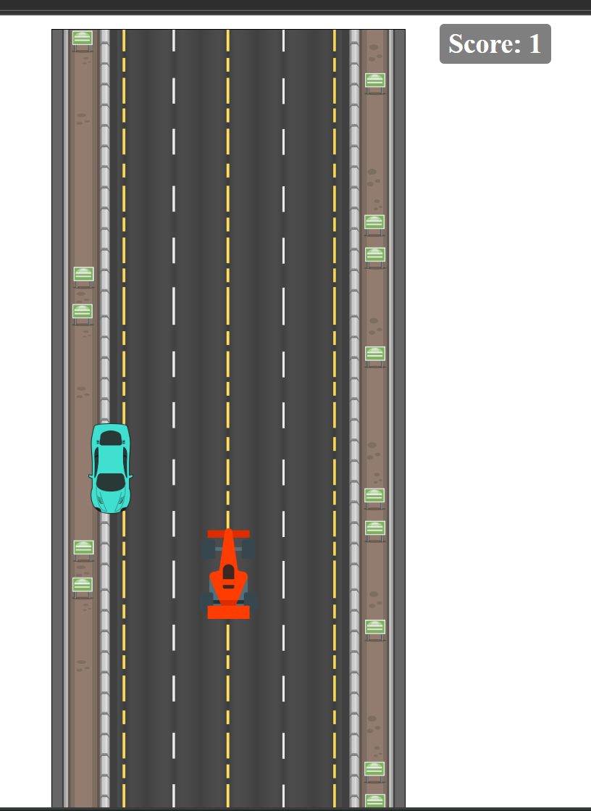

# Racing Moto Game 🏍️

A simple browser-based **Racing Moto Game** built with **HTML, CSS, and JavaScript**.  
Dodge the blue cars, survive as long as you can, and track your **live score**!

---

## 🔗 Live Demo

Play the game online: [Racing Moto Game](https://p-pranjali.github.io/racing-moto-game/)

---

## 🎮 Features

- 🚦 Interactive racing game with a **live score**  
- 🏍️ Smooth movement for the player’s race car  
- 🔵 Random blue cars appear from left or right  
- 🔊 Jump sound effect when pressing spacebar  
- ✅ Works in all modern browsers  

---

**## 🖼️ Screenshots**

**Game in Action**  

---

**## 🛠️ How to Run Locally**

1. Clone the repository:

2. Navigate to the project folder

3. Open index.html in your browser

**⚙️ File Structure**

racing-moto-game/
├─ index.html          # Main HTML file
├─ style.css           # CSS styling
├─ main.js             # Game logic (JS)
├─ bg.jpg              # Background image
├─ race.png            # Race car image
├─ blue.png            # Blue car image
├─ jumpsound.mp3       # Jump sound effect
└─ Screenshots/        # Folder for screenshots
   ├─ gameplay.png
   ├─ live-score.png
   └─ cars.png

   **📌 Notes**

For the best experience, play on a desktop browser.

Ensure your volume is on to hear jump sound effects.

Browser cache can sometimes show old versions — use Ctrl+Shift+R (Windows) or Cmd+Shift+R (Mac) to force refresh. And also Go to browser settings → Clear cached images and files.

**👩‍💻 Author**

P-Pranjali

GitHub: @P-Pranjali
